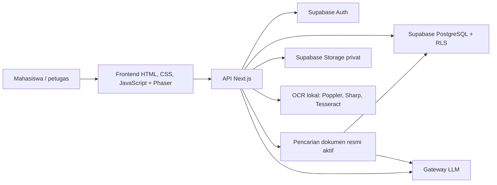

# Arsitektur, teknologi, dan kontribusi acara

Dokumen ini melengkapi [README.md](README.md). Status di bawah berdasarkan kode, dokumen checkpoint, dan riwayat Git yang tersedia pada 10 Oktober 2026.

## Arsitektur

| Lapisan | Implementasi | Tanggung jawab |
| --- | --- | --- |
| UI | `frontend/` | Pendaftaran/masuk, ruang interaktif, unggah scan, antrean petugas, ringkasan, dan chatbot. |
| API | `backend/app/api/` | Autentikasi permintaan, unggahan, scan, pengajuan, keputusan, berkas, dan AI. |
| Aturan | `backend/lib/scan.ts`, `validation.ts`, `vision.ts`, `fast-ocr.ts` | Ekstraksi data Form 14, pemeriksaan kelengkapan, dan validasi presensi. |
| Data | `database/001_form14.sql` sampai `005_rag_upgrade.sql` | Tabel, RPC, audit, bucket privat, dan Row Level Security. |
| AI | `backend/lib/dashboard-summary.ts`, `rag.ts`, `llm.ts` | Snapshot ringkasan dan pencarian sumber untuk chatbot; kunci gateway hanya di server. |

Ringkasan dashboard memakai data transaksi yang terlihat oleh petugas melalui RLS. Chatbot memakai pencarian teks atas potongan dokumen resmi aktif; bila hasil tidak cukup relevan, API mengembalikan penolakan tanpa memanggil model. Berkas pribadi Form 14 tidak menjadi korpus chatbot. Model OCR lokal berbeda dari LLM yang menulis ringkasan/jawaban.

## AI coding assistants, libraries, templates, dan boilerplate

| Jenis | Yang teridentifikasi | Peran dan bukti |
| --- | --- | --- |
| AI coding assistant | Codex | Dipakai untuk penyusunan dan verifikasi dokumentasi ini. |
| AI runtime | Gateway LiteLLM `litellm-hackathon.digdaya.ai`, model bawaan `qwen3.8-flash` | Dipanggil oleh `backend/lib/llm.ts` untuk ringkasan petugas dan jawaban berbasis dokumen. Nama model dapat diganti lewat `AI_MODEL`. |
| Frontend | Phaser 3.60.0, Tailwind CSS melalui CDN, Supabase JS melalui CDN | Ruang interaktif, gaya UI, dan sesi pengguna. |
| Backend | Next.js 16, React 19, TypeScript, `@supabase/supabase-js`, Zod | Server/API, integrasi Supabase, dan validasi input. |
| OCR/dokumen | Tesseract.js 7, `@tesseract.js-data/eng`, Sharp, `pdf-lib`, Poppler `pdftoppm` | Membaca gambar Form 14 dan mengubah PDF satu halaman menjadi gambar untuk OCR. |
| Database tool | `pg` | Skrip migrasi dan opsi ingest dokumen resmi dengan koneksi operator. |
| Template/boilerplate | Struktur proyek Next.js dan berkas frontend statis yang sudah ada; `backend/AGENTS.md` dibuat oleh proses Next.js | Tidak ada catatan yang dapat memverifikasi penggunaan template eksternal tertentu. Seluruh aset produk merupakan tanggung jawab Panca Puspita Sari. |

## Pekerjaan yang tampak selama event

- Frontend ruang interaktif, autentikasi, formulir mahasiswa, dan dashboard petugas dihubungkan ke API.
- Skema Form, alur scan, keputusan per baris, audit, RLS, serta migrasi pengetahuan dibuat untuk proyek demo.
- OCR lokal dan validasi kelengkapan Form 14 diintegrasikan dengan unggah berkas.
- Ringkasan dashboard dan chatbot BAAK berbasis sumber resmi ditambahkan. Korpus demo memakai Peraturan Akademik PENS 2024; prosedur Form 14 tetap di luar cakupan sampai dokumen resmi tersedia.
- Pengujian unit dan integrasi demo dicatat; hasil terkini unit/typecheck tercantum di README.

Pembagian tanggung jawab yang dikonfirmasi tim:

| Anggota | Pekerjaan |
| --- | --- |
| Eka Bayu Sakhrulban | Backend, OCR, dan AI. |
| Muhammad Fatan Makhsani | Frontend dan timeline. |
| Panca Puspita Sari | UI/UX dan seluruh aset produk. |

## Penggunaan token dan batas verifikasi

`backend/app/api/ai/chat/route.ts` menetapkan batas keluaran 250 token untuk ringkasan dan 180 token untuk chatbot. Kode tidak menyimpan `usage` dari respons gateway, sehingga angka total input/output token dan biaya aktual tidak dapat dihitung dari repo. Catatan pengujian gateway berada di `AI_ASSISTANT_CHECKPOINT.md`, tetapi tidak mencantumkan jumlah token. Angka resmi perlu diambil dari dasbor penyedia gateway atau laporan akun acara.

Uji otomatis lokal lulus 31/31 dan typecheck lulus pada 10 Oktober 2026. Validasi browser ujung ke ujung, p95 latensi, evaluasi korpus yang lebih luas, serta persetujuan BAAK atas jawaban prosedur belum memiliki bukti selesai. Rincian kasus yang telah dan belum diuji ada di [README.md](README.md) dan `AI_ASSISTANT_CHECKPOINT.md`.
